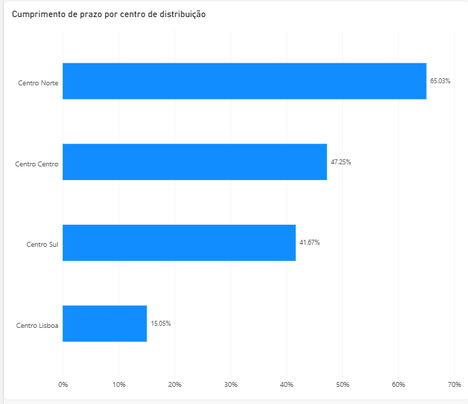

# Atrasos, stock e margem numa distribuidora industrial
Análise de desempenho logístico e inventário: auditoria de dados, SQL e Power BI

## O Problema
A administração da empresa Nortex apresenta três preocupações: Atrasos nas encomendas, Quantidade de capital imobilizado e a Queda da margem bruta.
A administração não sabia se estes três problemas estavam relacionados. Duas estão:
os atrasos e o excesso de stock são o mesmo problema, localizado no centro de Lisboa.
A queda de margem tem outra causa.

## Conclusões
As principais conclusões retiradas foram as seguintes:
  -o problema dos atrasos é abrangente a todos os centros mas é especialmente crítica no centro de Lisboa;
  -o problema do excesso de capital imobilizado é sobretudo preocupante no centro Lisboa que retém cerca de 67% do valor em stock;
  -os problemas dos atrasos nas encomendas e excesso de capital imobilizado poderão estar relacionados. Perante entregas pouco fiáveis, encomenda-se mais e mais     cedo por precaução, e o stock acumula;
  -A queda da Margem não pode ser confrimada sem acesso aos dados de 2024 mas é possível confirmar que o mix se deslocou fortemente para duas famílias com           margens mais baixas.

*O Centro Lisboa entrega a horas em 14,9% dos casos, contra 65,7% do Centro Norte.*

*O quarto trimestre teve a maior faturação do ano e o pior cumprimento de prazo.*

## Recomendações
1. Auditar o processo de Lisboa antes de reduzir stock, para não agravar o serviço.
2. Rever a política de descontos: 150 mil euros por ano concedidos sem relação com o volume.
3. A médio prazo, auditar os restantes centros: nenhum passa dos 66% de cumprimento de prazo.

## Método

Antes de qualquer cálculo, os dados foram auditados: foram identificados dez tipos de
problema, desde registos órfãos e datas impossíveis a descontos superiores a 100%.
Cada um foi tratado com uma decisão documentada (corrigir, excluir ou manter e
assinalar), aplicada na leitura sem alterar os dados de origem.

A análise cobriu quatro frentes: cumprimento de prazo, desempenho comercial, margem
e inventário. Em vez de assumir as causas mais óbvias, cada hipótese foi testada
contra os dados. Por exemplo, a falta de pessoal em Lisboa foi descartada ao
calcular a carga por operador, a mais baixa dos quatro centros.

O detalhe da auditoria e das decisões está na pasta `sql/`.

## Limitações
-A análise assenta apenas no exercício de 2025.
-Foram excluídos quatro registos por inconsistências de data ou de cliente, com impacto de 0,9% na faturação total.
-O custo de posse de stock é uma estimativa por intervalo, não um valor apurado.
-A atribuição da queda de margem permanece por confirmar até haver dados do exercício anterior.
-Os gráficos foram produzidos em Power BI com uma limpeza ligeiramente diferente (três encomendas com datas em formato inválido foram excluídas em vez de corrigidas). As taxas nos gráficos diferem por isso até 0,7 pontos percentuais das apresentadas neste texto, sem alterar nenhuma conclusão.

## Mais detalhe
- [Recomendação completa](recomendacao.md)
- [Sobre os dados](dados/NOTA.md): os dados são simulados, com problemas de qualidade introduzidos de propósito para a auditoria.
- [Queries SQL](sql/)

## Ferramentas
Ferramentas utilizadas: SQL (SQLite) para a auditoria e análise; Power BI para a visualização.

