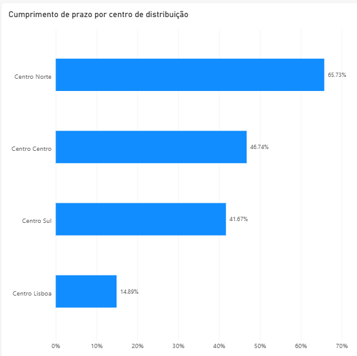
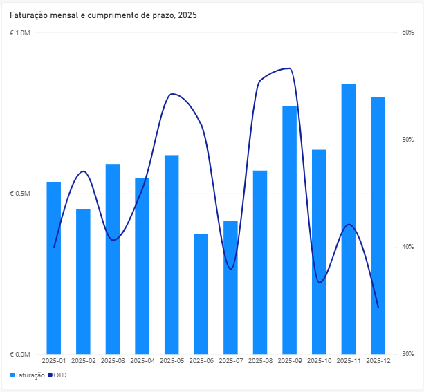

# Atrasos, stock e margem numa distribuidora industrial

Análise de desempenho logístico e inventário: auditoria de dados, SQL e Power BI.

## O problema

A administração da Nortex, uma distribuidora industrial com quatro centros de distribuição, apresentava três preocupações: atrasos nas entregas, excesso de capital imobilizado em stock e uma queda da margem bruta sem explicação aparente.

A administração não sabia se estes três problemas estavam relacionados. Dois estão: os atrasos e o excesso de stock são o mesmo problema, localizado no centro de Lisboa. A queda de margem tem outra causa.

## Principais conclusões

- **Os atrasos afetam todos os centros, mas Lisboa é o caso crítico.** Entrega dentro do prazo em 14,9% das encomendas, contra 65,7% no Centro Norte. Nenhum centro chega aos 90-95% de referência do setor.
- **A causa em Lisboa não é falta de stock nem de pessoal.** Não tem nenhuma referência abaixo do stock de segurança e é o centro com menor carga por operador. A causa mais provável é processual.
- **Lisboa concentra 67% do capital em stock** (2,38 M€), com 6,4 meses de cobertura média contra 1,4 a 1,6 meses nos outros centros. O custo de posse estimado é de 475 a 595 mil euros por ano.
- **Os atrasos e o excesso de stock estão provavelmente ligados.** Perante entregas pouco fiáveis, encomenda-se mais e mais cedo por precaução, e o stock acumula.
- **A queda de margem não pode ser confirmada sem os dados de 2024**, mas dentro de 2025 o mix deslocou-se para as duas famílias de menor margem, que passaram de 23,4% para 43,8% da receita entre o primeiro e o quarto trimestre.

*O Centro Lisboa entrega a horas em 14,9% dos casos, contra 65,7% do Centro Norte.*

*O quarto trimestre teve a maior faturação do ano e o pior cumprimento de prazo: a operação degrada quando o volume sobe.*

## Recomendações

1. **Auditar o processo de Lisboa antes de reduzir o stock.** Cortar inventário num centro que já entrega mal agravaria o serviço.
2. **Rever a política de descontos.** São 150 mil euros por ano concedidos sem relação com o volume que cada cliente compra.
3. **A médio prazo, auditar os restantes centros.** Nenhum passa dos 66% de cumprimento de prazo, o que aponta para um problema estrutural e não só local.

## Método

Antes de qualquer cálculo, os dados foram auditados: foram identificados dez tipos de problema, desde registos órfãos e datas impossíveis a descontos superiores a 100%. Cada um foi tratado com uma decisão documentada (corrigir, excluir ou manter e assinalar), aplicada na leitura sem alterar os dados de origem.

A análise cobriu quatro frentes: cumprimento de prazo, desempenho comercial, margem e inventário. Em vez de assumir as causas mais óbvias, cada hipótese foi testada contra os dados. Por exemplo, a falta de pessoal em Lisboa foi descartada ao calcular a carga por operador, a mais baixa dos quatro centros.

O detalhe da auditoria e das decisões está na pasta `sql/`.

## Limitações

- A análise assenta apenas no exercício de 2025.
- Foram excluídos quatro registos por inconsistências de data ou de cliente, com impacto de 0,9% na faturação total.
- O custo de posse de stock é uma estimativa por intervalo, não um valor apurado.
- A causa da queda de margem permanece por confirmar até haver dados do exercício anterior.

## Ferramentas

SQL (SQLite) para a auditoria e a análise; Power BI para a visualização.

## Mais detalhe

- [Recomendação completa](recomendacao.md)
- [Sobre os dados](dados/NOTA.md): os dados são simulados, com problemas de qualidade introduzidos de propósito para a auditoria.
- [Queries SQL](sql/)

